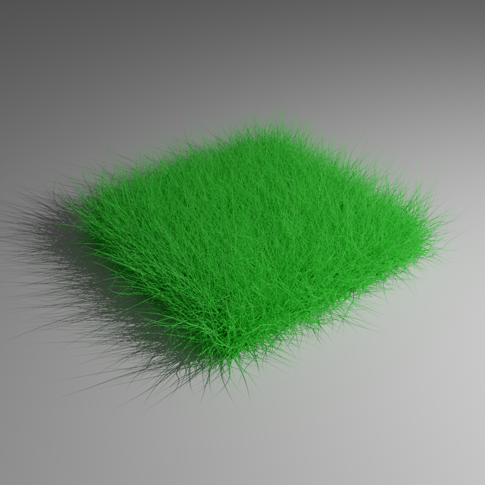
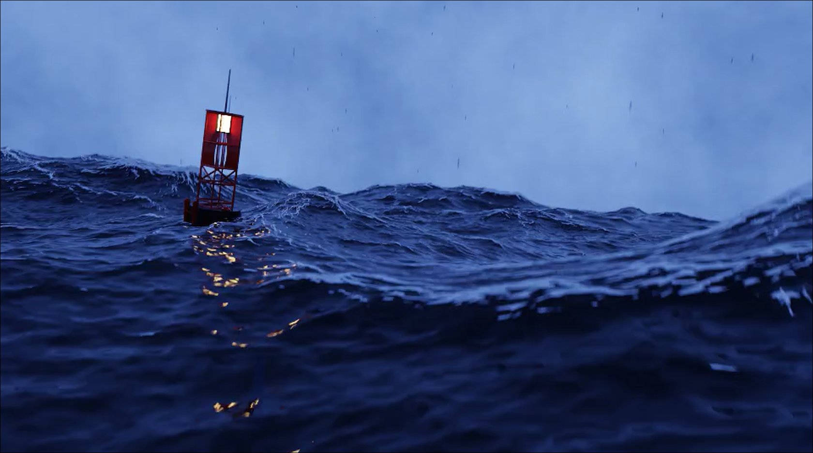
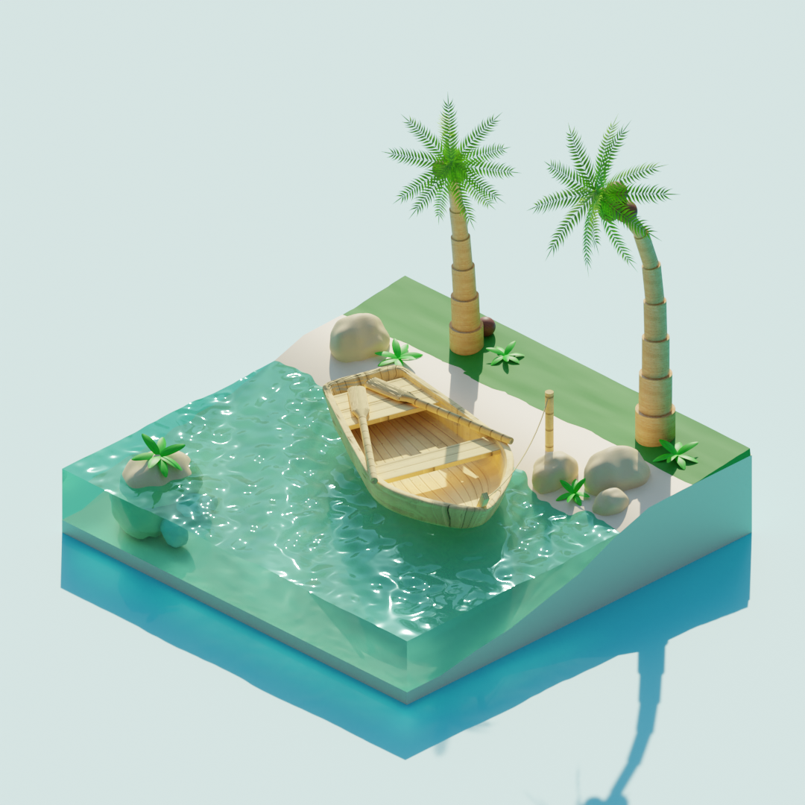

# Blender Artworks
 **This repository is a collection of my completed Blender projects, including a number of 3D models, animations, and renderers created throughout my journey in 3D design.**

## Table of Artworks
- [Fireworks](#fireworks)
- [Grass](#grass)
- [Magic Night House](#magic-night-house)
- [Stormy Ocean](#stormy-ocean)
- [Tropical Island](#tropical-island)

## Fireworks
***A vibrant display of fireworks in a night sky, exploring particle systems and dynamic lighting effects.***
  
  

## Grass
***A realistic render of grass created using particle systems, highlighting detailed texturing and shading techniques.***
  
  

## Magic Night House
***A whimsical scene of a night house with magical elements, focusing on lighting and atmosphere.***
  
  

## Stormy Ocean
***A dramatic ocean scene featuring stormy weather and a buoy model, showcasing environment simulations and realistic water dynamics.***
  
  

## Tropical Island
***A serene tropical island scene with a boat, emphasizing lush environments and detailed modeling.***
  
  
